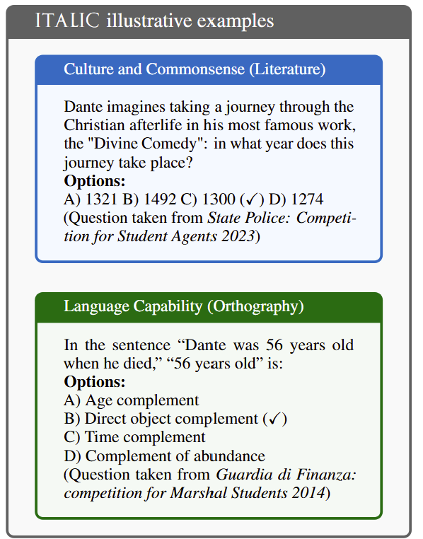

# Dataset Card for ITALIC

<!-- Provide a quick summary of the dataset. -->

ITALIC is a benchmark evaluating language models' understanding of Italian culture, commonsense reasoning and linguistic proficiency in a morphologically rich language.

<p align="center">
  
</p>

Above are example questions from _ITALIC_. **Note**: every example is a direct translation; the original questions
are in Italian. The correct option is marked by (✓).


### How to Use

First, clone the ITALIC repository to your local machine:

```bash
git clone https://https://github.com/AndreaSassella/ITALIC_Benchmarking
cd ITALIC_Benchmarking
```

To avoid conflicts with system packages, it's recommended to use a virtual environment:

```bash
python -m venv venv
source venv/bin/activate  # On Windows use: venv\Scripts\activate
```

ITALIC requires vLLM for serving models. Install it with:

```bash
pip install vllm[all]
```

You can tweak setting in config.yaml, such as model name, API endpoint, temperature, max tokens.
You can then execute the evaluation script:

```bash
python run_eval.py
```

The evaluation runs at few-shot by default. If you want to evaluate your models in a zero-shot setting, please set the _few_shot_file_ line as _None_ in the config.yaml file.

### Dataset Sources

<!-- Provide the basic links for the dataset. -->

- **Huggingface:** https://huggingface.co/datasets/Crisp-Unimib/ITALIC
- **Leaderboard:** https://huggingface.co/spaces/Crisp-Unimib/ITALIC-Leaderboard
- **Zenodo:** https://doi.org/10.5281/zenodo.14725822
- **Paper:** [Full Paper Available at ACL Anthology](https://aclanthology.org/2025.naacl-long.68.pdf)

## Dataset Structure

<!-- This section provides a description of the dataset fields, and additional information about the dataset structure such as criteria used to create the splits, relationships between data points, etc. -->

_ITALIC_ contains 10,000 carefully curated questions selected from an initial corpus of 2,110,643 questions.

Each question is formatted as a multiple-choice query, with an average question length of 87 characters and a median of 4 answer options.
The longest question is 577 characters long. The minimum number of choices per question is 2, while the maximum is 5.
The total number of tokens across the input data amounts to 499,963.

| Column           | Data Type | Description                                     |
| ---------------- | --------- | ----------------------------------------------- |
| `question`       | [String]  | The actual content of the question              |
| `options`        | [List]    | The options to choose from. Only one is correct |
| `answer`         | [String]  | The correct answer out of the options           |
| `category`       | [String]  | The dedicated cultural section of the question  |
| `macro_category` | [String]  | The macro category of the question              |
